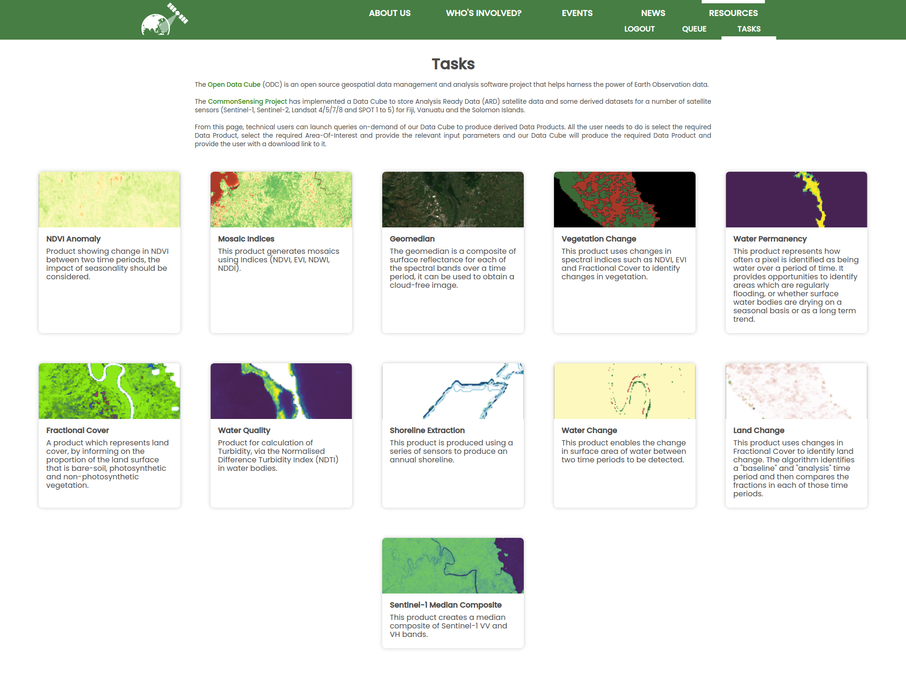
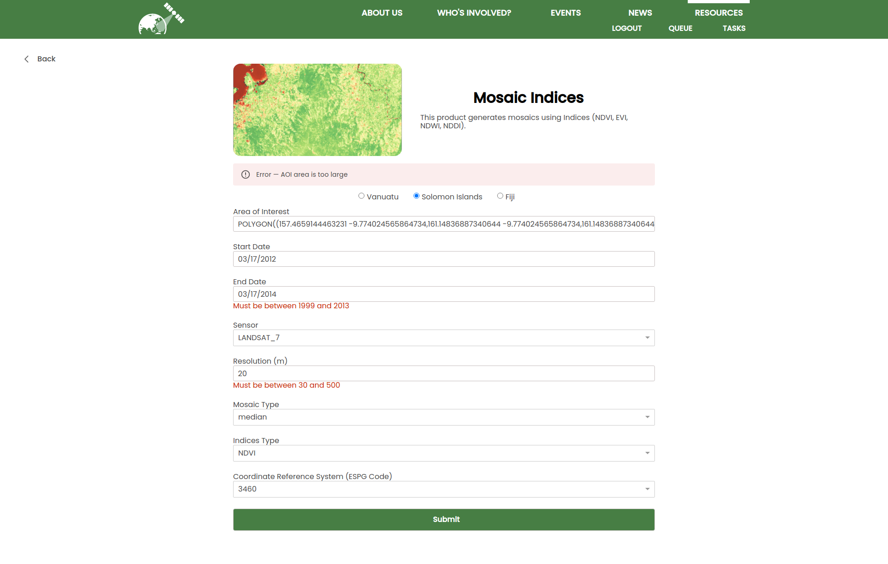
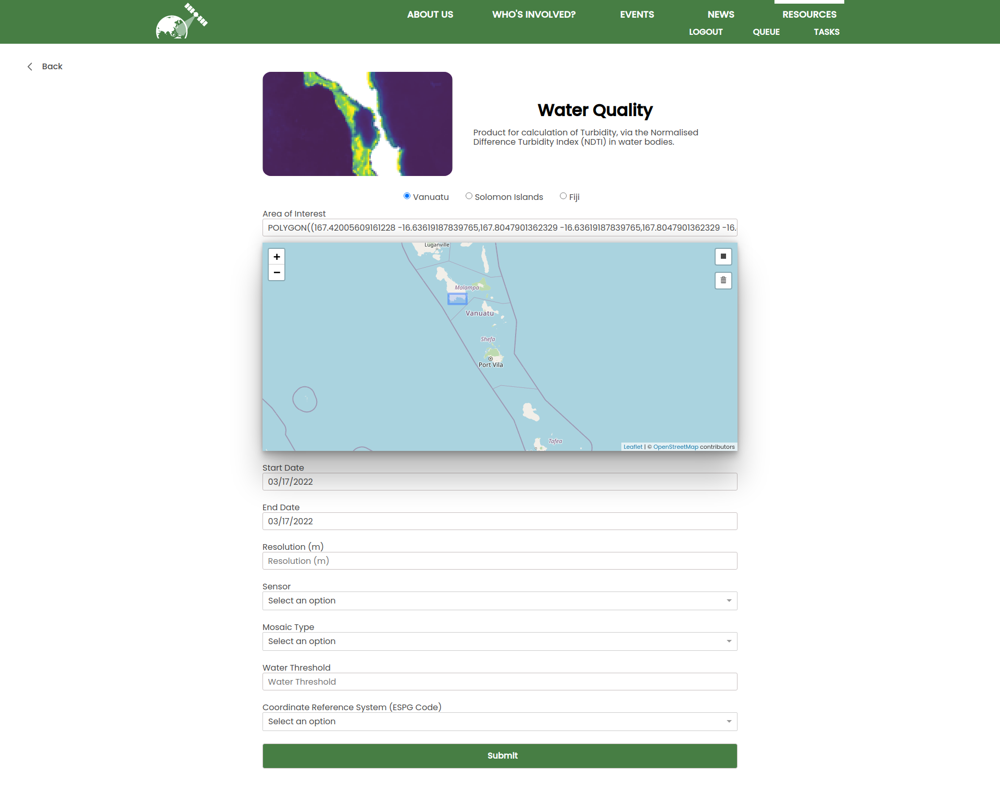
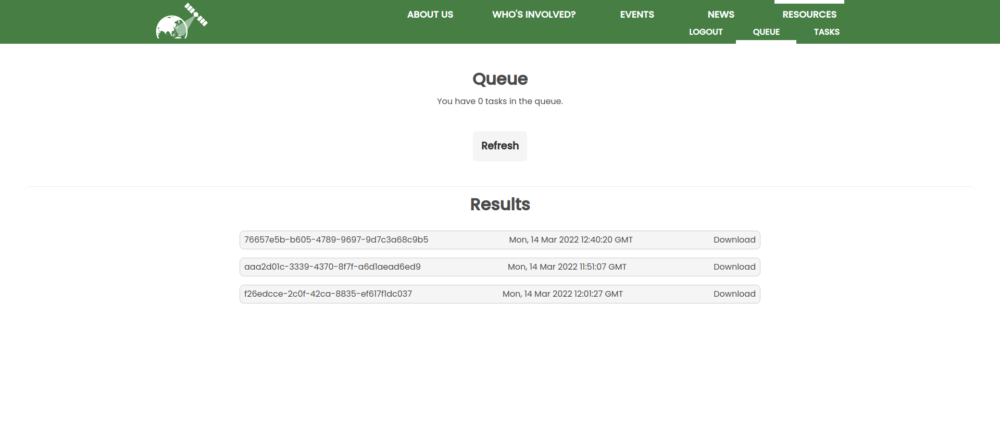

# Cube Page
This project was created to interact with cube products as part of the CommonSensing project.

Token authorization is required to use the API and is provided by the CSOpenPortal https://github.com/SatelliteApplicationsCatapult/csopenportal

## Available Scripts

In the project directory, you can run:

`npm run start`

`npm run build`

# Examples

## `View all products`

Select any available tasks to launch cube products.

  

---

## `Interact with a product with live input validation`

Validates input based on the dynamic settings found in _src/components/form/Validate.js_

  

---

## `Use a map to create WKT aoi`

Draw an AOI onto the map and get live validation on the AOI specified

  

---

## `View your queue and download results`

The authorised user gets a list of all the tasks in the queue and can download the results of any completed tasks.

  

